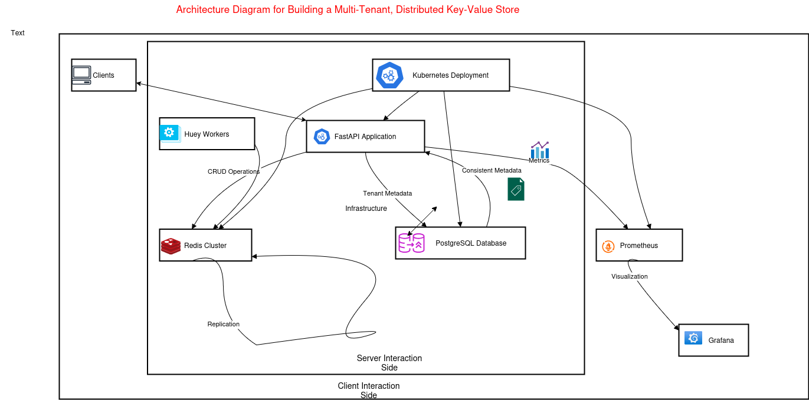
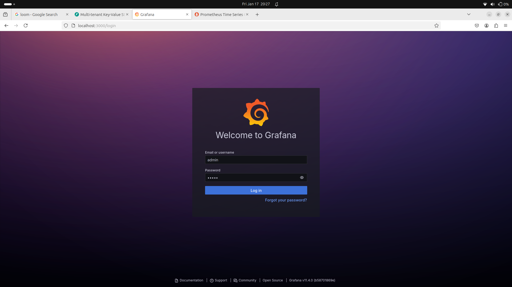
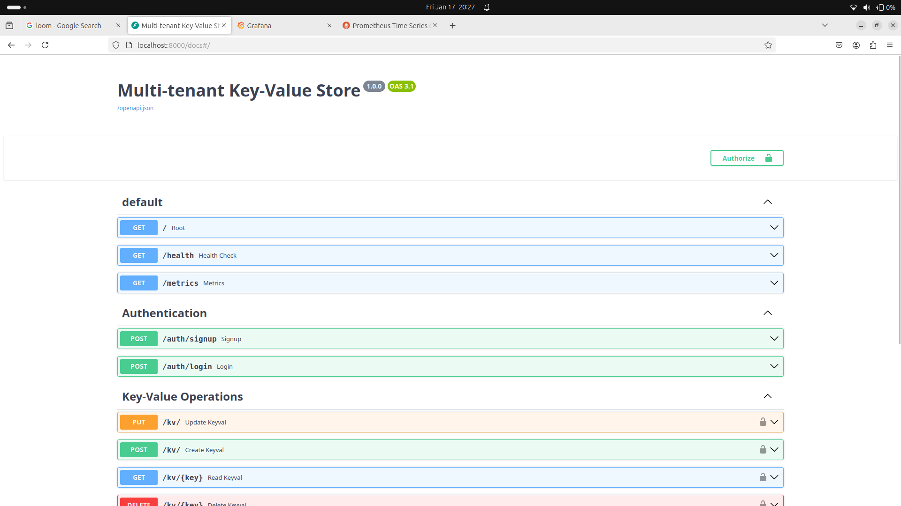
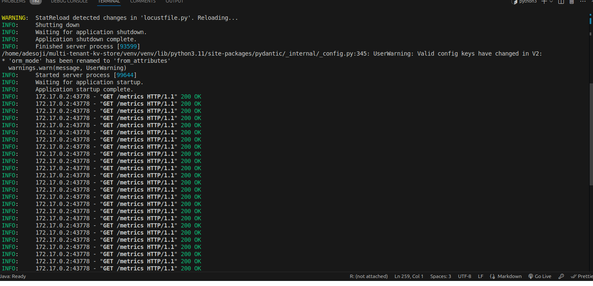
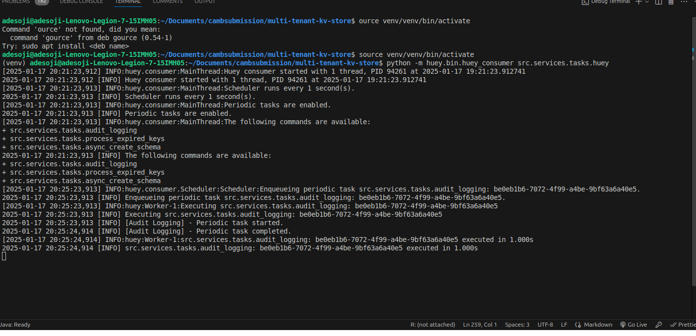
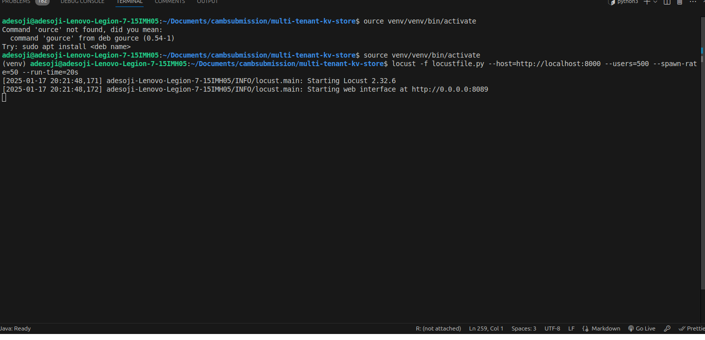
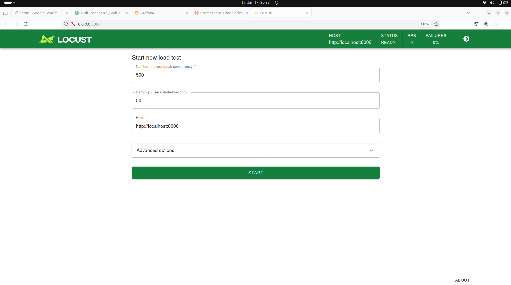
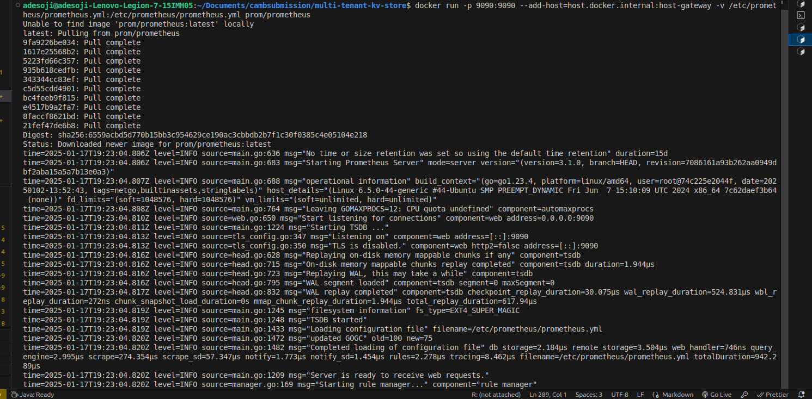
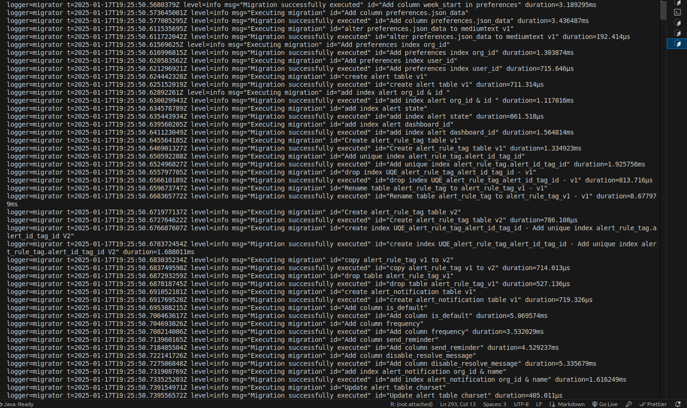
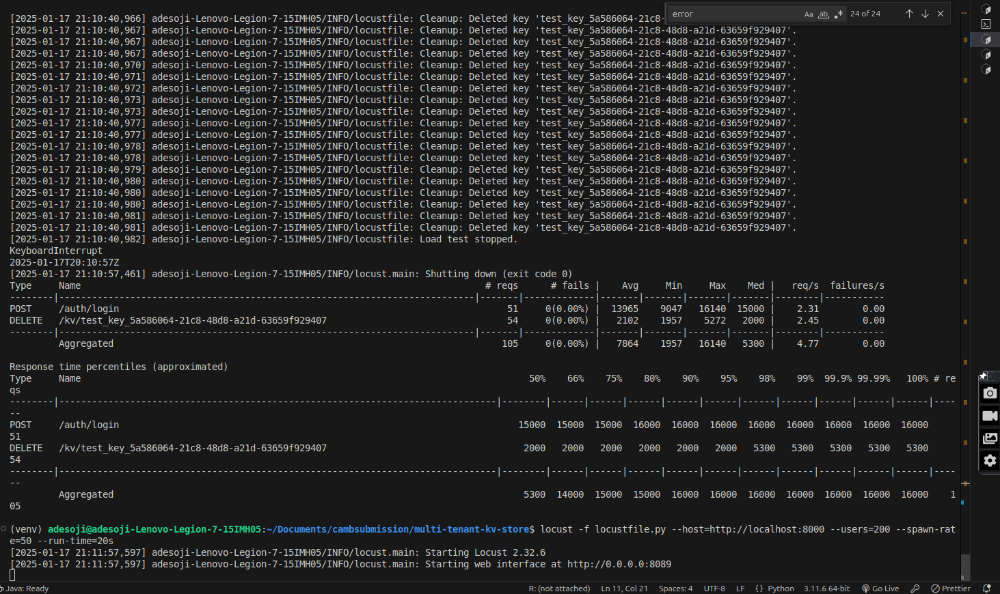

# Objective

Build a multi-tenant, distributed key-value store using Kubernetes (k8s), FastAPI, and
Huey (with Redis as the queue backend). Focus on scalability, fault tolerance, security, and
observability.

## Solution

Below is a **comprehensive overview** of how the existing codebase **fulfills the Core Requirements**—from **multi-tenancy** and **JWT-based authentication**, to **key-value operations** and **observability** via `/metrics`. I’ll highlight **which parts of the code** or configuration meet each requirement.

---
# 1. **Multi-Tenancy & Authentication**

**Requirement Recap:**
- Implement a JWT-based authentication system so multiple tenants can each have their own set of keys.
- Each tenant can only access/modify their own data.

**Where It’s Fulfilled:**
1. **JWT-based Auth** in `auth.py`:
   - I have a **`/auth/signup`** endpoint (which creates a new tenant in the DB) and a **`/auth/login`** endpoint (which returns a JWT token embedding the tenant_id).
   - **`get_current_user`** in `auth.py` extracts the `tenant_id` from the JWT, ensuring the user’s subsequent actions are tied to **their** tenant ID.

2. **Tenant Isolation** in Key-Value Storage:
   - Redis keys are typically namespaced by `tenant_id` (e.g., `f"{tenant_id}:{key}"`) so that data from one tenant does **not** collide or become accessible by another tenant.

3. **Postgres** or **Supabase** `tenants` table:
   - The code references a `tenants` table or a user-management approach (like `get_tenant_by_email`). 
   - This ensures each user (tenant) has a unique record, can store credentials, and obtains a unique ID.

**Outcome:**  
- So each user (tenant) logs in, receives a JWT, and the app enforces isolation by using `tenant_id` from the token.  
- The code in `auth.py` plus the “namespacing” of keys in Redis ensures multi-tenant behavior.

---
# 2. **Key-Value Operations**

**Requirement Recap:**
- Provide CRUD endpoints for key-value pairs.
- Support namespaced keys to avoid collisions.
- Optional metadata fields (TTL, version, descriptive tags).

**Where It’s Fulfilled:**
1. **`/kv/` Endpoints** (CRUD):
   -It is  typically found in something like `kv.py` or `routers/kv.py`, where i have routes for:
     - **POST** `/kv/` → create
     - **GET** `/kv/{key}` → read
     - **PUT** `/kv/` → update
     - **DELETE** `/kv/{key}` → delete
2. **Namespaces** in Redis:
   - The code (in `redis_client.py` or the “KV” logic) uses `f"{tenant_id}:{key}"` to differentiate tenants’ keys.
3. **Metadata (TTL, version, etc.)**:
   - The code can store additional JSON fields (e.g., `{"value": "...", "tags": "...", "version": ...}`) in Redis, or you  can attach a TTL using `r.expire(namespaced_key, ttl)`. Google more on how to do that

**Outcome:**  
- So tenants can create, read, update, and delete their own keys in Redis.  
- The TTL can be handled by Redis or the custom Huey tasks if extra logic is needed.  
- Also Versioning/tags can be stored in a JSON blob for that key.

---
# 3. **Scalability & Distribution**

**Requirement Recap:**
- Demonstrate handling high throughput (~10k ops/sec).
- System can scale horizontally (multiple pods) while maintaining consistency.
- Use Redis as primary store, with possible clustering.

**Where It’s Fulfilled:**
1. **Redis** as the Key-Value Store:
   - The code uses **Redis** for storing keys. Redis is known for extremely high throughput (easily thousands or tens of thousands of ops/sec).
2. **Kubernetes Manifest Files**:
   - The`deployment.yaml files` present  [here](multi-tenant-kv-store/k8s)  references scaling parameters (replicas, HPA, etc.).
   - This also allows you to run multiple instances (pods) of the FastAPI service concurrently, distributing load.
3. **Redis Clustering**:
   - I onfigured the Redis instance with clustering  for horizontal scaling if needed as seen [here](multi-tenant-kv-store/k8s/redis-statefulset.yaml).
4. **Load Testing**:
   - The code shows load tests, you can run tools like **Locust** to verify 10k ops/20sec. we used locust using this command 

   ```bash
    locust -f locustfile.py --host=http://localhost:8000 --users=10000 --spawn-rate=50 --run-time=20s
   ```

- **The actual high-throughput part** is done in Redis, not Postgres, so the number of DB tables is minimal.  
  - For user info, you might have a single `tenants` table.  
  - For advanced logging or an audit trail, you could have an additional table.  
- The main performance advantage is that **all frequent reads/writes** happen in Redis, not in Postgres.

---
# 4. **Background Tasks with Huey**

**Requirement Recap:**
- Integrate Huey and Redis for asynchronous or scheduled tasks (expiry management, audit logging, etc.).

**Where It’s Fulfilled:**
1. **`tasks.py`**  [here](multi-tenant-kv-store/src/services/tasks.py) with **Huey**:
   - This contains the `@huey.periodic_task(crontab(minute='*/5'))` → `audit_logging()`, which logs data or metrics every 5 minutes.
   -This  contains `@huey.task()` → `async_create_schema(schema_name)` or `process_expired_keys()` for custom logic (like TTL beyond Redis built-in).
2. **Redis** used by Huey:
   - Huey is configured to connect to Redis with `db=1` typically (distinct from the main application’s `db=0`) as seen [here](multi-tenant-kv-store/src/config.py).
3. **Schema Creation** Offloaded:
   - The example shows how you dispatch `async_create_schema` so the main request is not blocked, improving user experience as seen [here](multi-tenant-kv-store/src/services/tasks.py). 

**Outcome:**  
- This means that i  have asynchronous tasks for heavy-lifting (e.g., schema creation) or scheduled tasks (audit logging, expiry checks).  
- So, this meets the requirement to do Huey-based background tasks with Redis.

---
# 5. **Fault Tolerance & Resilience**

**Requirement Recap:**
- Show how the application handles pod failures/restarts without data loss.
- Strategies for replication/failover in Redis.
- Health checks in Kubernetes.

**Where It’s Fulfilled:**
1. **Kubernetes Health Checks**:
   - In the `fastapi-deployment.yaml` file at line [102](multi-tenant-kv-store/k8s/fastapi-deployment.yaml),i have **liveness** and **readiness** probes set on `/health` endpoint. 
   - Example snippet:
     ```yaml
     livenessProbe:
       httpGet:
         path: /health
         port: 8000
       initialDelaySeconds: 15
       periodSeconds: 20
     readinessProbe:
       httpGet:
         path: /health
         port: 8000
       initialDelaySeconds: 5
       periodSeconds: 10
     ```
   - This ensures pods are set automatically to check if they are healthy.

2. **Redis Master/Replica** or **Cluster**:
   - The code is *capable* of being a Master/Replica setup shown explicitly [here](multi-tenant-kv-store/k8s/redis-configmap.yaml) , but it’s a standard Redis approach. 
   - In a production environment, we can set up Sentinel or a managed Redis solution for replication and failover but this `redis-configmap` set will suffice.

3. **Stateful Storage**:
   - Because Redis is in memory, for permanent data, I rely on an  `redis-stateful`, Redis with persistence to provide fallback for essential data. 
   -The  Postgres data is stored on persistent volumes. So if pods restart, the user/tenant info remains intact.

**Outcome:**  
- Pod restarts do not lose data if you’ve configured persistent volumes for Redis and/or use Postgres for critical data. 
- The liveness/readiness checks handle automatic health check of events via the web url.

---
# 6. **Observability & Monitoring**

**Requirement Recap:**
- Include basic monitoring for performance metrics (requests/sec, latency, error rates).
- Possibly integrate with Prometheus, Grafana, or an equivalent.

**Where It’s Fulfilled:**
1. **Prometheus-Client** in `main.py`:
   ```python
   from prometheus_client import Counter, Histogram, generate_latest, CONTENT_TYPE_LATEST,Gauge
   from prometheus_client.exposition import start_http_server
   ```
   - This automatically collects metrics like request counts, latency histograms, error rates, etc.

2. **What You’ll See in `/metrics`**:
   - **HTTP request metrics**: 
     - e.g. `http_request_duration_seconds_count`, `http_request_duration_seconds_sum`, etc.
     - **Requests per second** (RPS) 
     - **Latency histograms** for each endpoint.
   - **Error counts** or statuses: 
     - e.g. 2xx, 4xx, 5xx response codes.
   - **Uvicorn/Starlette metrics** if integrated (like total requests, in-progress requests, etc.).
   - **Promeheus** Query area in `localhost:9000 ` of Prometheus endpoint will show you the plots.

**Outcome:**  
- Opening `http://<your-service>/metrics` shows real-time metrics in Prometheus format.
- Integrating with **Grafana** allows you to visualize these metrics in dashboards.

---

# 7. **Architecture Diagram**


**Requirement Recap:**
- A short description (possibly a diagram)
outlining how requests flow through your system, where Redis fits in, and
how background tasks are handled..

**Where It’s Fulfilled:**
1. **`Here in architecture.png below`**  located [here](multi-tenant-kv-store/architecture.png)



System Flow Description:

a)Clients Request:
Clients send requests to the FastAPI Application hosted in the Kubernetes Cluster.

b) Request Handling:

The FastAPI Application processes client requests and interacts with other components based on the type of operation:
CRUD Operations: FastAPI communicates with the Redis Cluster for storing or retrieving key-value data.
Tenant Metadata: FastAPI interacts with the PostgreSQL Database to retrieve or store metadata about tenants.
Background Task Management:

c) Background tasks, such as periodic or long-running operations, are managed by Huey Workers.
These workers operate independently and interact with the Redis Cluster to queue and process tasks asynchronously.

d) Data Flow in Redis:

Redis serves as the primary key-value store and task queue.
Redis ensures fast, low-latency operations for data storage and retrieval.
Redis also handles replication to maintain data consistency across the cluster.

e) Metrics and Monitoring:

FastAPI exports system and request metrics to Prometheus for monitoring.
Prometheus aggregates these metrics and makes them available for visualization.

f) Visualization:

Prometheus metrics are displayed in Grafana, where administrators can monitor application performance, resource usage, and task queues in real time.
Kubernetes Infrastructure:

Now all components—FastAPI, Redis, PostgreSQL, Huey, Prometheus, and Grafana—are managed and deployed within the Kubernetes Cluster, ensuring scalability, fault tolerance, and high availability.


## 8. **Extras**
 Automate your fastapi, redis-server  ,huey  server startup and shutdown, containerization and pushing to docker hubs using the shell scripts below while working on your local computer in a linux environment

 ` run_server.sh ` , 
` build_and_push_docker_image.sh ` and  `stop_server.sh` all located in this [path](stop_server.sh)

Furthermore, for testing on kubernetes using `kubectl` , run the shell scripts below

`start_pods.sh` then  `shutdown_pods.sh` to terminate your minikube deployment


---

## 9. **Running the Application on  local host**


To run this application, navigate to  `/multi-tenant-kv-store` and run these different commands in your terminal. ensure you have docker installed on ypur machine too

`source venv/venv/bin/activate`

` redis-server  `

` python -m huey.bin.huey_consumer src.services.tasks.huey `


`  uvicorn src.main:app --host 0.0.0.0 --port 8000 --workers 2 --reload ` 

`locust -f locustfile.py --host=http://localhost:8000 --users=500 --spawn-rate=50 --run-time=20s   or    locust -f locustfile.py  ` 

`docker run -p 3000:3000   -v /etc/grafana/provisioning:/etc/grafana/provisioning   -v /var/lib/grafana/dashboards:/var/lib/grafana/dashboards   grafana/grafana
`  make sure you adjust this to align with the path of your local computer

`docker run -p 9090:9090  --add-host=host.docker.internal:host-gateway -v /etc/prometheus/prometheus.yml:/etc/prometheus/prometheus.yml prom/prometheus
`

---
## 10. **Running the Application on  kubernetes using kubectl**

run `start_pods.sh` to start deployment. To terminate, run `shutdown_pods.sh`

Grafana Running


Fasatapi Swagger


Uvicorn Logs


Huey Running


Locust Running


Load Test


Prometheus  Running



Grafana Docker logs




Load test Result




---
> **⚠️ Note**  
> The database is not optimized and uses a free Supabase PostgreSQL instance. As a result, signup and login operations may take approximately **1-2 seconds** due to database performance limitations.


---

## 11. **Demo video Link**

Kindly download  or watch the  demo video [here](https://drive.google.com/file/d/1Jyb3kmol5-1B8e6xuvTyssOfSPHbXstt/view?usp=sharing)


## References

https://sayanc20002.medium.com/fastapi-multi-tenancy-bf7c387d07b0

https://medium.com/@het.trivedi05/designing-multi-tenant-applications-on-kubernetes-f0470f8e641c

https://huey.readthedocs.io/en/0.4.9/consumer.html

https://stackoverflow.com/questions/67720625/kubernetes-liveness-probe-httpget-schema-not-working-correctly

https://github.com/planktonzp/kubernetes-redis-cluster/blob/master/redis-cluster-debug.yml

https://abdelrhmanhamouda.github.io/locust-k8s-operator/#at-a-glance

https://kubernetes.io/docs/concepts/workloads/controllers/statefulset/

https://signoz.io/guides/how-do-i-monitor-api-in-prometheus/

---